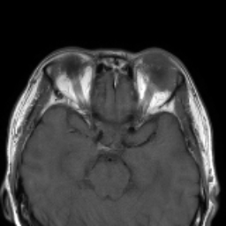
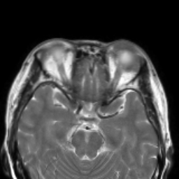
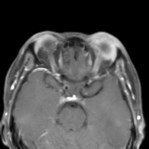
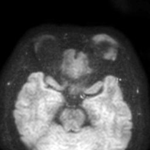
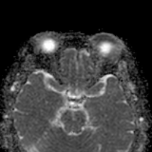
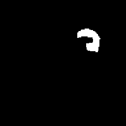
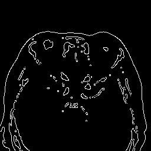

# ASLDM

Code for **"Anatomy-aware Sketch-guided Latent Diffusion Model for Orbital Tumor Multi-Parametric MRI Missing Modalities Synthesis"**

This repository contains code and example data for training and testing the ASLDM model on the OTTS dataset, enabling synthesis of missing modalities from multi-parametric MRI using anatomical sketch guidance.

---

## 🧠 OTTS Example Data

Below are examples of each modality used in our model:
<table> <tr> <td align="center"><b>T1WI</b><br> <br> <i>Anatomical structure</i> </td> <td align="center"><b>T2WI</b><br> <br> <i>Edema/fluid sensitivity</i> </td> <td align="center"><b>T1CE</b><br> <br> <i>Contrast-enhanced lesion</i> </td> <td align="center"><b>DWI</b><br> <br> <i>Diffusion signal</i> </td> </tr> <tr> <td align="center"><b>ADC</b><br> <br> <i>Quantitative diffusion</i> </td> <td align="center"><b>Seg</b><br> <br> <i>Tumor mask</i> </td> <td align="center"><b>Sketch</b><br> <br> <i>Structural prior</i> </td> <td></td> </tr> </table>

---

## ⚙️ Setup Instructions

### 1. Environment Setup

We recommend using Python 3.9+ and creating a virtual environment:

```bash
conda create -n asldm python=3.12
conda activate asldm
```

### 2. Install Dependencies

```bash
pip install -r requirements.txt
```

Additional dependencies might include:

* `torch >= 2.0`
* `torchvision`
* `monai`
* `scikit-image`
* `pillow`
* `numpy`
* `tqdm`
* `itertools`
* `tqdm`
* `natsort`

### 3. Download OTTS Dataset (Optional)

Place the data in the `data/test/` directory. File names should follow:

```
<data_root>/<modality>/<sample_id>-<modality>-slice_<slice_id>.png
```

---

## 🚀 Inference Example

Run inference with a sketch input and available modalities:

```bash
python test.py 
```

---

## 📂 Folder Structure

```
ASLDM/
├── data/
│   └── test/
│       ├── t1n/
│       ├── t2w/
│       ├── t1c/
│       ├── dwi/
│       ├── adc/
│       ├── seg/
│       └── sketch/
├── models/
├── test.py
├── train.py
└── README.md
```
